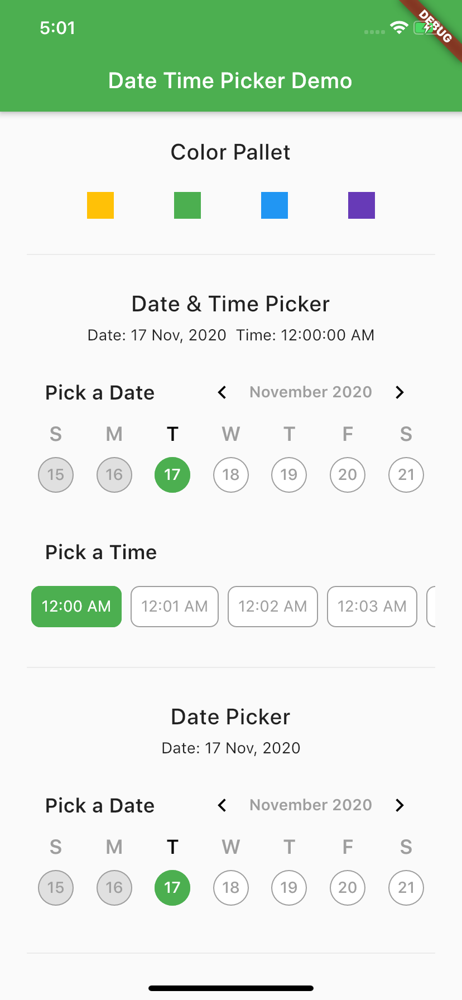

# date_time_picker_widget

[](https://pub.dartlang.org/packages/date_time_picker_widget)

This package brings us a way to pick date and time with fresh new UI design

## Usage

In the `pubspec.yaml` of your flutter project, add the following dependency:

```yaml
dependencies:
  ...
  date_time_picker_widget: ^0.1.0
```

In your library add the following import:

```dart
import 'package:date_time_picker_widget/date_time_picker_widget.dart';
```

For help getting started with Flutter, view the online [documentation](https://flutter.io/).

## Example

There are three presentations for DateTimePickerWidget and can be defined in the type parameter:
* `DateTimePickerType.Date` will present date picker;
* `DateTimePickerType.Time` will present time picker;
* `DateTimePickerType.Both` will present date and time picker both;

``` dart
DateTimePicker(
  type: DateTimePickerType.Both, // options: [Date | Time | Both], default is Both
  ...
)
```

More complete example:


``` dart
DateTimePicker(
  initialSelectedDate: dt,
  startDate: dt.add(Duration(days: 1)),
  endDate: dt.add(Duration(days: 60)),
  startTime: DateTime(dt.year, dt.month, dt.day, 6),
  endTime: DateTime(dt.year, dt.month, dt.day, 18),
  timeInterval: Duration(minutes: 15),
  datePickerTitle: 'Pick your preferred date',
  timePickerTitle: 'Pick your preferred time',
  timeOutOfRangeError: 'Sorry shop is closed now',
  is24h: false,
  onDateChanged: (date) {
    setState(() {
      _d1 = DateFormat('dd MMM, yyyy').format(date);
    });
  },
  onTimeChanged: (time) {
    setState(() {
      _t1 = DateFormat('hh:mm:ss aa').format(time);
    });
  },
)
```

## Screen Shot
